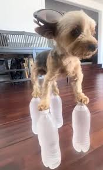
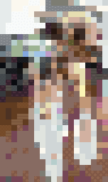
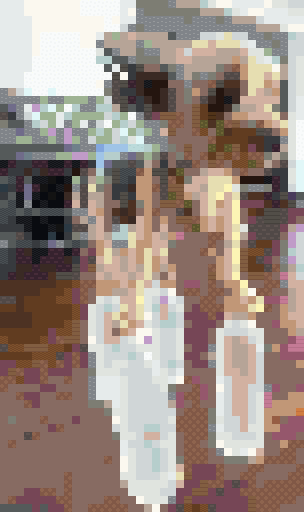
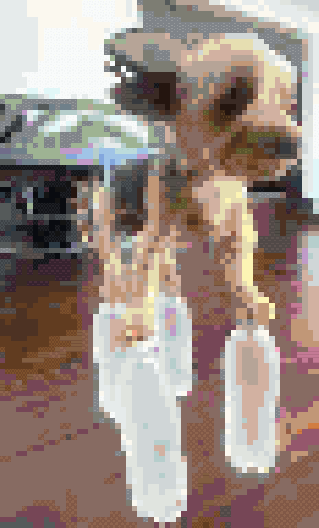
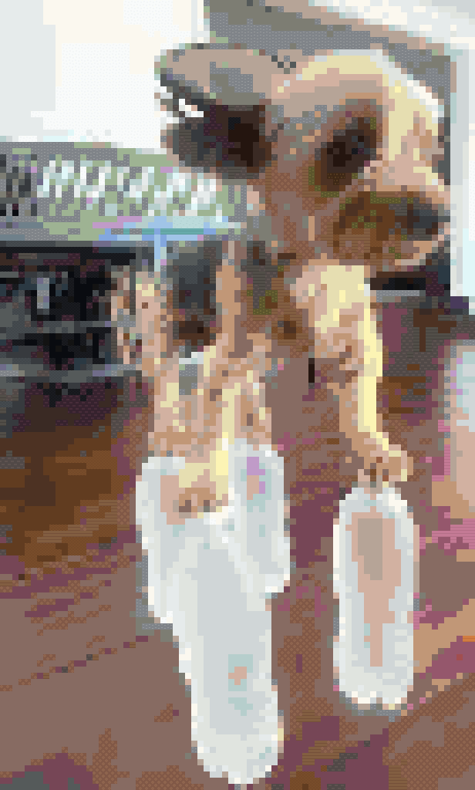

# Voxelator

Voxelator is a Python-based tool designed to convert any standard image into a 2D array of block IDs. This array can be used to construct a pixel-art-style representation of the image in any voxel-based game, such as Minecraft, Minetest, Bloxd, or your own custom project.

The system is composed of two main scripts: one for pre-processing block textures into a color cache, and another for converting an input image using that cache.

## How It Works

The process is split into two parts: analysis and conversion.

1.  **`preprocess.py` - Texture Analysis & Cache Generation**
    This script analyzes your game's block textures. For each non-slab block face, it calculates:
    *   The average RGB color.
    *   Whether the texture has any transparency.
    *   Whether the texture is a "monocolor" (i.e., a solid color with very little variation).

    This data is saved into `block_color_cache.json`. This is a crucial pre-processing step that significantly speeds up the image conversion process. You only need to run it once, or whenever your game's block textures are updated.

2.  **`main.py` - Image to Block Conversion**
    This is the main script that performs the conversion. It does the following:
    *   Loads the input image and resizes it according to the `MAX_HEIGHT` setting.
    *   Iterates through each pixel of the resized image.
    *   For each pixel, it finds the best-matching block from the `block_color_cache.json` based on color distance and other configured preferences.
    *   It generates two output files:
        *   A `_blocks.json` file containing the 2D array of block IDs.
        *   A `_preview.png` file that stitches together the actual block textures to provide a high-fidelity preview of the final result.

## The Output JSON

The primary output, `dog_standing_on_4_water_bottles_blocks.json`, is a JSON file containing a 2D array (an array of arrays) of integers.

```json
[
  [8, 8, 8, 132, 132, 132, ...],
  [8, 8, 8, 132, 132, 132, ...],
  ...
]
```

Each integer in the array corresponds to a `blockId` from the `block_texture_map.json` file. This data structure can be easily parsed by a game engine or a script to place the blocks in the game world, effectively "building" the image.

## Examples

Using `dog_standing_on_4_water_bottles.jpg` as the input, we can generate different results by adjusting the `MAX_HEIGHT` variable in `main.py`. This allows for control over the final detail and block count.

### Original Image



### Result (MAX_HEIGHT = 32)

A very low resolution creates a highly stylized, minimalist version of the image.



### Result (MAX_HEIGHT = 64)

By doubling the height, we get a more abstract, "pixelated" look that uses fewer blocks but is more recognizable.



### Result (MAX_HEIGHT = 96)

This resolution offers a good balance between detail and block count, clearly defining the subject.



### Result (MAX_HEIGHT = 128)

This creates a detailed, high-resolution version of the image with the most accuracy.



## How to Use

1.  **Adapt for Your Game:**
    This tool is game-agnostic. To adapt it for your specific game, you must provide:
    *   **`texture_atlas_*.png`:** One or more texture atlas files where each block texture is a square (e.g., 8x8, 16x16). The files should be named sequentially starting from `texture_atlas_0.png`.
    *   **`block_texture_map.json`:** A JSON file that maps your game's unique `blockId` to its name and its texture locations on the atlases.

2.  **Generate Color Cache:**
    Run the `preprocess.py` script. This will read your texture map and atlases and generate the `block_color_cache.json` file.
    ```bash
    python preprocess.py
    ```

3.  **Configure the Conversion:**
    Open `main.py` and modify the configuration variables at the top of the file.

4.  **Run the Conversion:**
    Execute the `main.py` script.
    ```bash
    python main.py
    ```
    This will produce a `_blocks.json` file and a `_preview.png` image in the same directory.

## Configuration Options (`main.py`)

You can customize the conversion process by changing these variables:

*   `INPUT_IMAGE_PATH`: The path to the image you want to convert.
*   `MAX_HEIGHT`: The maximum height of the output in blocks. The width will be scaled automatically to maintain the aspect ratio.
*   `VIEWING_DIRECTION`: Determines which face of the blocks is used for color matching. This is essential for games where blocks have different textures on different sides (like logs or furnaces).
    *   Options: `"face_0_Right_PlusX"`, `"face_1_Left_MinusX"`, `"face_4_Front_PlusZ"`, `"face_5_Back_MinusZ"`.
*   `PREFER_MONO_COLORS`: If `True`, the script will prioritize using blocks with solid, uniform colors if their color is a close enough match. This can result in a cleaner, more stylized output.
*   `NO_TRANSPARENT_BLOCKS`: If `True`, blocks with any level of transparency (like glass) will be excluded from the selection process.
*   `MONO_COLOR_THRESHOLD`: A numerical value that defines how close a monocolor block's color must be to a pixel's color to be chosen over a potentially closer, but more textured, block. A lower value means the match must be more precise.